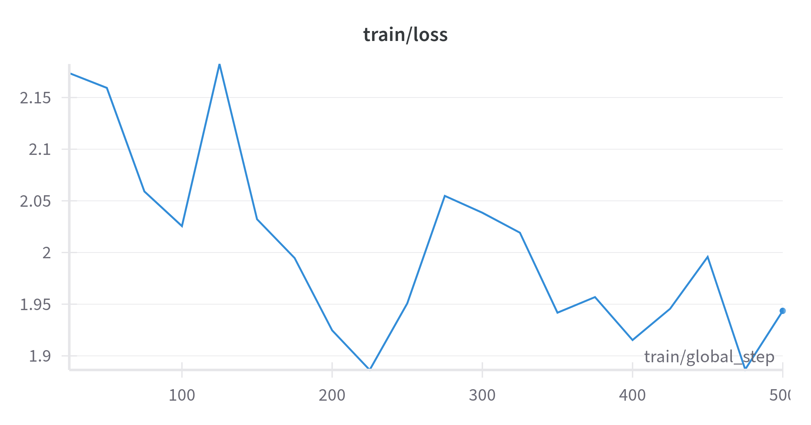

# Mistral_fine_tuning

*Florian Dufaure - Volodia Fernandez*

## Introduction

Nous sommes parties de [Mistral](https://huggingface.co/mistralai/Mistral-7B-v0.1) afin de créer un générateur de phrase en le fine tunant avec du light novel

[Dataset Light Novel](https://huggingface.co/datasets/alpindale/light-novels)


Notre modèle est sur Hugging Face à l'adresse suivante : [Mistral-fine-tuning-light-novel](https://huggingface.co/FloVolo/mistral-flo-finetune-2-T4)

## Version en local

Nous avons eu quelques soucis avec le fonctionnement depuis Hugging Face, donc il est possible de tester notre modèle en local depuis le fichier **Light_Novel_Generation.ipynb**.

Pour cela il suffit d'aller à la fin du fichier dans la partie *Test en local de notre fichier*. Et de modifier l'**eval_prompt** afin que notre modèle le complète.


## Running

Pour lancer notre service il suffit de faire 

```py
python app.py
```

Et de se rendre sur l'url indiqué dans le terminal et de générer ce qu'on veut.

## Entrainement du modèle

Nous avons entrainé le modèle sur une petite partie du dataset par manque de temps et sur une époque.

Voici la courbe de loss durant le training du modèle



